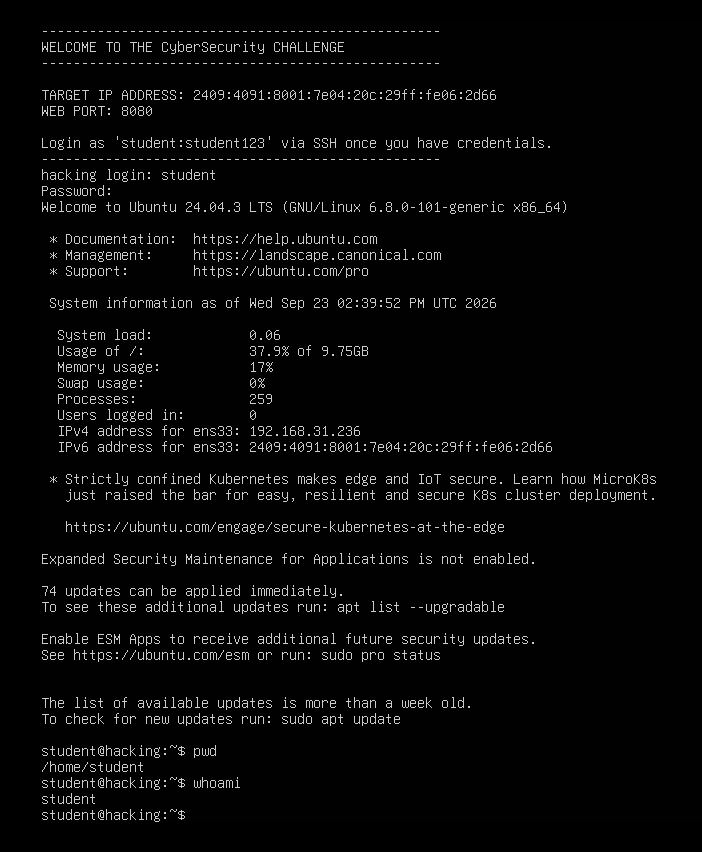

# Assignment 1: Linux Command-Line Basics

**Course:** Cybersecurity, Tutedude
**Author:** Sai Aditya
**Topic:** Orientation on a Linux target machine (`pwd` and `whoami`)

---

## Overview

Before you can enumerate, exploit, or defend a Linux system, you need to answer two questions: **where am I?** and **who am I?** This assignment covers the two commands that answer them, `pwd` and `whoami`, and documents the output captured from the lab machine.

These are the first commands run after gaining a shell in almost every scenario, whether it's a CTF, a penetration test, or a SOC investigation on a suspicious host.

## Objectives

- Identify the current working directory using a Linux command
- Identify the user account the session is running as
- Record the commands, outputs, and screenshot evidence

## Lab Environment

| Item | Details |
|---|---|
| Operating system | Ubuntu 24.04.3 LTS |
| Kernel | Linux 6.8.0-101-generic (x86_64) |
| Hostname | `hacking` |
| Logged-in user | `student` |
| Shell prompt | `student@hacking:~$` |
| Session date | Wed, 23 Sep 2026 |

---

## Task 1: Show the current directory

**Question:** What command shows the current directory?

**Command**

```bash
pwd
```

**Output**

```text
/home/student
```

### Explanation

`pwd` stands for **print working directory**. It prints the absolute path of the directory your shell is currently in, starting from the root (`/`).

The output `/home/student` is the home directory of the `student` user. This matches the `~` in the shell prompt (`student@hacking:~$`), since `~` is shorthand for the current user's home directory.

**Useful options**

| Option | Behaviour |
|---|---|
| `pwd -L` | Logical path, keeps symbolic links as-is (default in Bash) |
| `pwd -P` | Physical path, resolves symbolic links to the real location |

**Why it matters in security:** Knowing your exact location is essential when navigating an unfamiliar system, running scripts with relative paths, or locating files such as configs, logs, and credentials.

---

## Task 2: Show the logged-in username

**Question:** What is the username you are logged in as?

**Command**

```bash
whoami
```

**Output**

```text
student
```

### Explanation

`whoami` prints the **effective username** of the user running the current shell. Here it returns `student`, a standard, unprivileged account. This tells us the session does not have administrator (root) rights.

**Why it matters in security:** Your privilege level determines what you can read, modify, and execute. Checking `whoami` is typically the first step in privilege-escalation work: a low-privileged user like `student` has to find a route to higher access, while a defender wants to confirm that services and users are running with the least privilege necessary.

---

## Screenshot Evidence



*Figure 1: Login to the lab machine, followed by `pwd` returning `/home/student` and `whoami` returning `student`.*

---

## Observations from the Login Banner

The system banner shown at login also gives a quick look at the machine's state:

- **OS:** Ubuntu 24.04.3 LTS, running kernel 6.8.0-101-generic
- **Pending updates:** 74 updates were available and the package list was more than a week old. On a real system, unapplied patches increase the attack surface, and this is the kind of thing vulnerability management and SOC teams track.
- **Ubuntu Pro / ESM Apps:** Not enabled, so extended security maintenance for application packages is not active.
- **Network interface:** `ens33` is the active interface, configured with both IPv4 and IPv6 addresses.

---

## Key Takeaways

1. `pwd` shows **where** you are in the filesystem, and `whoami` shows **who** you are on the system.
2. Both are quick, safe, read-only commands that are the foundation of situational awareness on any Linux host.
3. Running as a non-root user (`student`) reflects the principle of least privilege.
4. Documenting commands with their output and screenshots makes work reproducible, which is a core habit in penetration testing and incident response.

---

## Related Commands (Extra Practice)

These weren't required for the assignment, but they build naturally on `pwd` and `whoami`:

| Command | What it does |
|---|---|
| `id` | Shows your user ID, group ID, and all group memberships |
| `hostname` | Prints the name of the machine |
| `uname -a` | Displays kernel version and system architecture |
| `ls -la` | Lists all files, including hidden ones, with permissions |
| `cd ~` | Returns to your home directory from anywhere |

---

## Disclaimer

This work was completed in an authorized, purpose-built training environment provided by the course. It is shared for educational purposes only. Only run security tools and commands on systems you own or have explicit permission to test.
