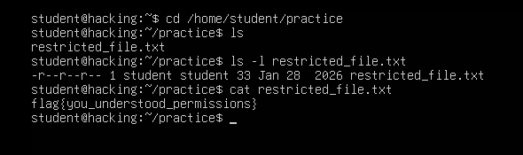
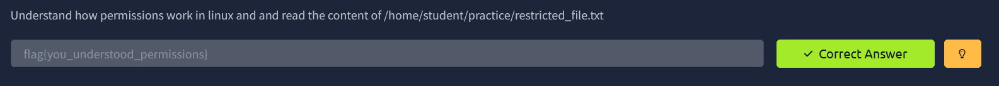

# Assignment 2: Understanding Linux File Permissions

**Course:** Cybersecurity, Tutedude
**Author:** Sai Aditya
**Topic:** Reading file permissions with `ls -l` and accessing a file with `cat`

---

## Overview

Linux controls who can read, modify, or run every file through a permission system. Misconfigured permissions are one of the most common weaknesses found during security assessments, so being able to read and interpret them is a core skill for both attackers and defenders.

In this assignment, the goal was to understand how permissions work and use that understanding to read the contents of a file located at `/home/student/practice/restricted_file.txt`.

## Objectives

- Navigate to a target directory and list its contents
- Inspect a file's permissions, owner, and group with `ls -l`
- Determine whether the current user is allowed to read the file
- Read the file and retrieve the flag

## Lab Environment

| Item | Details |
|---|---|
| Operating system | Ubuntu (lab machine, hostname `hacking`) |
| Logged-in user | `student` |
| Target file | `/home/student/practice/restricted_file.txt` |
| Platform for flag submission | TryHackMe |

---

## Walkthrough

### Step 1: Move to the practice directory and list its contents

```bash
cd /home/student/practice
ls
```

**Output**

```text
restricted_file.txt
```

`cd` changes the working directory, and `ls` lists the files in it. The directory contains a single file, `restricted_file.txt`, which is the target.

### Step 2: Inspect the file's permissions

```bash
ls -l restricted_file.txt
```

**Output**

```text
-r--r--r-- 1 student student 33 Jan 28  2026 restricted_file.txt
```

The `-l` option switches `ls` to the long listing format, which shows permissions, ownership, size, and modification date. Here is how to read that line:

| Field | Value | Meaning |
|---|---|---|
| File type | `-` | A regular file (a directory would show `d`) |
| Owner permissions | `r--` | The owner can read, but not write or execute |
| Group permissions | `r--` | Members of the group can read, but not write or execute |
| Others permissions | `r--` | Everyone else can read, but not write or execute |
| Link count | `1` | Number of hard links to the file |
| Owner | `student` | The user who owns the file |
| Group | `student` | The group that owns the file |
| Size | `33` | File size in bytes |
| Modified | `Jan 28 2026` | Last modification date |
| Name | `restricted_file.txt` | The file name |

### Step 3: Read the file

```bash
cat restricted_file.txt
```

**Output**

```text
flag{you_understood_permissions}
```

`cat` prints a file's contents to the terminal. It only works if the current user has **read** permission, which the previous step confirmed.

### Step 4: Submit the flag

The flag was entered on TryHackMe and accepted as correct.

---

## Understanding the Permission Model

Permissions are made up of three types, applied to three classes of user:

| Symbol | Permission | On a file | On a directory |
|---|---|---|---|
| `r` | Read | View the contents | List the contents |
| `w` | Write | Modify the contents | Create or delete files inside |
| `x` | Execute | Run it as a program | Enter it with `cd` |

| Class | Who it covers |
|---|---|
| Owner (user) | The account that owns the file |
| Group | Members of the file's group |
| Others | Everyone else on the system |

Permissions can also be written in **octal** notation, where read = 4, write = 2, and execute = 1, added together for each class. The file in this assignment is `-r--r--r--`, which is **444** (4 for owner, 4 for group, 4 for others).

### Why the user could read this file

The user `student` is the **owner** of the file, and the owner, group, and **others** classes all have read access. Every class has `r`, so `cat` succeeds regardless of which class applies. No special privileges were needed.

### A note on the file name

Despite being called `restricted_file.txt`, this file is not actually restricted: all three classes can read it. It is a good reminder that a file's name says nothing about its access controls. In a real assessment, the permissions are what matter. A file holding sensitive data with `r--r--r--` (444) would be readable by every user on the system, and a security review should flag it.

The size of 33 bytes is also consistent with the content: the flag is 32 characters, plus one trailing newline character.

---

## Screenshot Evidence

### Terminal session



*Figure 1: Navigating to the practice directory, checking permissions with `ls -l`, and reading the flag with `cat`.*

### TryHackMe answer submission



*Figure 2: The flag accepted as a correct answer on TryHackMe.*

---

## Key Takeaways

1. `ls -l` reveals a file's type, permissions, owner, group, size, and modification date in one line.
2. Permissions are read as three groups of three characters: owner, group, others.
3. Whether a command like `cat` works depends on the permissions for the class the current user falls into.
4. A file's name is not a security control. Always check the actual permissions.
5. Overly permissive files (such as world-readable ones holding sensitive data) are a common finding in security audits.

---

## Related Commands (Extra Practice)

These were not required for the assignment, but build directly on the concepts above:

| Command | What it does |
|---|---|
| `stat file` | Shows detailed file information, including the octal permission mode |
| `chmod 600 file` | Changes permissions (here: owner read/write only) |
| `chown user:group file` | Changes the owner and group of a file |
| `id` | Shows your user, primary group, and group memberships |
| `ls -ld directory` | Shows permissions of a directory itself rather than its contents |

---

## Disclaimer

This work was completed in an authorized, purpose-built training environment provided by the course. It is shared for educational purposes only. Only run security tools and commands on systems you own or have explicit permission to test.
