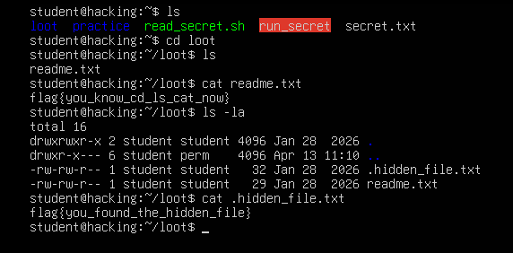
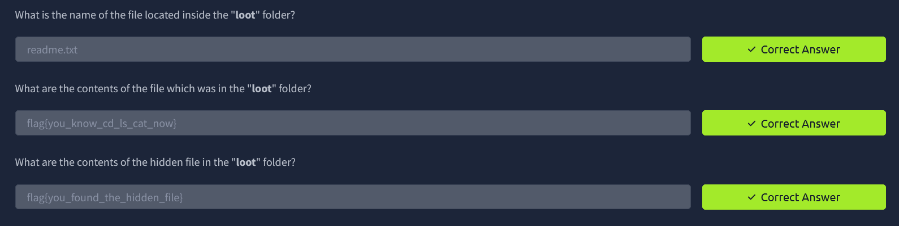

# Assignment 3: File System Navigation and Hidden Files

**Course:** Cybersecurity, Tutedude
**Author:** Sai Aditya
**Topic:** Navigating directories with `cd`, listing with `ls`, reading with `cat`, and finding hidden files with `ls -la`

---

## Overview

Enumeration, meaning systematically finding out what exists on a system, is one of the first phases of any penetration test or CTF. On Linux, that starts with three commands: `cd` to move around, `ls` to see what is there, and `cat` to read it.

This assignment adds one more idea: **not everything shows up in a normal listing**. Files whose names start with a dot are hidden by default, and finding them takes an extra option on `ls`.

## Objectives

- Navigate into a directory named `loot` using `cd`
- List its contents and read the visible file with `ls` and `cat`
- Reveal a hidden file using `ls -la` and read its contents

## Lab Environment

| Item | Details |
|---|---|
| Operating system | Ubuntu (lab machine, hostname `hacking`) |
| Logged-in user | `student` |
| Starting directory | `/home/student` (shown as `~` in the prompt) |
| Target directory | `/home/student/loot` |
| Platform for answer submission | TryHackMe |

---

## Walkthrough

### Step 1: List the home directory

```bash
ls
```

**Output**

```text
loot  practice  read_secret.sh  run_secret  secret.txt
```

The home directory contains five visible items. The `loot` directory is the target for this assignment. The other items were not needed here.

Terminal colours give a quick hint about each item. With the default GNU `ls` colour scheme, blue is a directory (`loot`, `practice`), green is an executable file (`read_secret.sh`), and plain white is a regular file (`secret.txt`). The red highlight on `run_secret` is normally used for a **setuid** file, which is worth noting because setuid binaries run with their owner's privileges and are a common target in privilege-escalation work. It was not part of this task.

### Step 2: Enter the `loot` directory and list its contents

```bash
cd loot
ls
```

**Output**

```text
readme.txt
```

`cd loot` changes into the directory using a **relative path** (relative to the current location). The prompt changes from `~` to `~/loot` to confirm the move. A plain `ls` shows only one file: `readme.txt`.

### Step 3: Read the visible file

```bash
cat readme.txt
```

**Output**

```text
flag{you_know_cd_ls_cat_now}
```

### Step 4: Reveal hidden files

```bash
ls -la
```

**Output**

```text
total 16
drwxrwxr-x 2 student student 4096 Jan 28  2026 .
drwxr-x--- 6 student perm    4096 Apr 13 11:10 ..
-rw-rw-r-- 1 student student   32 Jan 28  2026 .hidden_file.txt
-rw-rw-r-- 1 student student   29 Jan 28  2026 readme.txt
```

This is the key step. The two options combine as follows:

| Option | Meaning |
|---|---|
| `-l` | Long format: permissions, owner, group, size, and date |
| `-a` | All files, including those whose names begin with a dot |

Two things stand out in the result:

- **`.hidden_file.txt`** did not appear in the plain `ls`. Its leading dot is what hides it.
- **`.` and `..`** are also listed. `.` is the current directory (`loot`), and `..` is its parent, which here is the home directory (`/home/student`).

### Step 4a: Reading the listing

| Entry | Permissions | Meaning |
|---|---|---|
| `.` (`loot`) | `drwxrwxr-x` (775) | Directory. Owner and group can read, write, and enter it. Others can read and enter it. |
| `..` (home) | `drwxr-x---` (750) | Directory owned by `student`, group `perm`. Owner has full access, the group can read and enter, others have no access. |
| `.hidden_file.txt` | `-rw-rw-r--` (664) | Regular file, 32 bytes. Owner and group can read and write, others can read. |
| `readme.txt` | `-rw-rw-r--` (664) | Regular file, 29 bytes. Same permissions as above. |

The line `total 16` is the disk space used by the listed entries, in 1 KiB blocks. Four entries at one 4 KiB block each gives 16.

### Step 5: Read the hidden file

```bash
cat .hidden_file.txt
```

**Output**

```text
flag{you_found_the_hidden_file}
```

Both file sizes match their contents: `readme.txt` is 29 bytes (28 characters plus a newline) and `.hidden_file.txt` is 32 bytes (31 characters plus a newline).

---

## Answers Submitted

| # | Question | Answer |
|---|---|---|
| 1 | Name of the file inside the `loot` folder | `readme.txt` |
| 2 | Contents of the file in the `loot` folder | `flag{you_know_cd_ls_cat_now}` |
| 3 | Contents of the hidden file in the `loot` folder | `flag{you_found_the_hidden_file}` |

All three were accepted as correct on TryHackMe.

---

## Screenshot Evidence

### Terminal session



*Figure 1: Navigating into `loot`, reading `readme.txt`, revealing the hidden file with `ls -la`, and reading it.*

### TryHackMe answer submission



*Figure 2: All three answers accepted as correct on TryHackMe.*

---

## Why Hidden Files Matter in Security

A leading dot is only a display convention. It keeps clutter out of normal listings, but it is **not** a security control: any user who can read the directory can see hidden files by adding `-a`. This echoes a point from the previous assignment, where a file's name said nothing about its real access controls.

Hidden files and directories are worth checking during any enumeration because they commonly hold sensitive data, such as:

- `.bash_history`: a record of commands the user has run
- `.ssh/`: SSH keys and known hosts
- `.env`: application configuration, often including passwords or API keys
- `.config/`: application settings and saved credentials

Defenders benefit from the same habit: attackers may hide tools or persistence mechanisms in dot-files, so checking with `ls -la` is a routine part of investigating a host.

---

## Key Takeaways

1. `cd`, `ls`, and `cat` are the core enumeration commands: move, look, read.
2. A plain `ls` does not show everything. Use `ls -la` to include hidden files and see full details.
3. Files starting with `.` are hidden by convention, not protected. Hiding is not security.
4. `.` means the current directory and `..` means the parent directory.
5. Reading `ls -l` output (type, permissions, owner, group, size, date) tells you what you can do with each entry.

---

## Related Commands (Extra Practice)

These were not required for the assignment, but build on the same skills:

| Command | What it does |
|---|---|
| `ls -A` | Lists hidden files but leaves out `.` and `..` |
| `cd ..` | Moves up one directory to the parent |
| `cd -` | Returns to the previous directory |
| `cd` | With no argument, returns to your home directory |
| `find ~ -name ".*" -type f` | Searches your home directory for hidden files, including in subdirectories |

---

## Disclaimer

This work was completed in an authorized, purpose-built training environment provided by the course. It is shared for educational purposes only. Only run security tools and commands on systems you own or have explicit permission to test.
