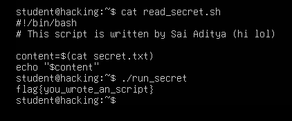

# Assignment 4: Bash Scripting, Reading a Protected File

**Course:** Cybersecurity, Tutedude
**Author:** Sai Aditya
**Topic:** Writing a Bash script that reads a file into a variable and prints it

---

## Overview

Scripting turns one-off commands into repeatable tools. Security work relies on it constantly, whether that is enumerating a system, parsing logs, or automating a scan. Bash is the default shell on most Linux systems, so it is the natural first scripting language to learn.

In this assignment, the task was to write a Bash script that reads the contents of `secret.txt`, stores the result in a variable, and prints the variable. The script was then run using `./run_secret`.

## Objectives

- Edit an existing script file (`read_secret.sh`) with a text editor
- Use **command substitution** to store a command's output in a variable
- Print the variable and run the script to retrieve the flag

## Lab Environment

| Item | Details |
|---|---|
| Operating system | Ubuntu (lab machine, hostname `hacking`) |
| Logged-in user | `student` |
| Working directory | `/home/student` (shown as `~` in the prompt) |
| Script to edit | `read_secret.sh` |
| Launcher used to run it | `run_secret` |
| File to read | `secret.txt` |
| Platform for answer submission | TryHackMe |

---

## The Script

```bash
#!/bin/bash
# This script is written by Sai Aditya (hi lol)

content=$(cat secret.txt)
echo "$content"
```

The script is also saved in this folder as [`read_secret.sh`](read_secret.sh).

### Line-by-line explanation

| Line | What it does |
|---|---|
| `#!/bin/bash` | The **shebang**. It tells the system to run the file using the Bash interpreter. It must be the first line. |
| `# This script is ...` | A **comment**. Lines starting with `#` are ignored by Bash and exist for humans. |
| `content=$(cat secret.txt)` | **Command substitution.** `$(...)` runs the command inside and captures its output, which is assigned to the variable `content`. There must be no spaces around the `=`. |
| `echo "$content"` | Prints the variable's value. `$content` reads the variable, and the double quotes preserve its exact formatting and stop Bash from splitting it into separate words. |

One detail worth knowing: command substitution removes trailing newlines from the captured output, and `echo` adds one back when printing. The result looks the same as running `cat secret.txt` directly.

---

## Walkthrough

### Step 1: Write the script

The assignment allows any text editor. The `read_secret.sh` file was edited to contain the script shown above, then saved.

### Step 2: Check the script contents

```bash
cat read_secret.sh
```

**Output**

```text
#!/bin/bash
# This script is written by Sai Aditya (hi lol)

content=$(cat secret.txt)
echo "$content"
```

Displaying the file with `cat` confirms that the saved contents are what was intended before running anything.

### Step 3: Run it

```bash
./run_secret
```

**Output**

```text
flag{you_wrote_an_script}
```

The script ran successfully and printed the contents of the protected file.

### Step 4: Submit the flag

The flag was entered on TryHackMe and accepted as correct.

---

## Why `./run_secret`?

Two points explain the command that was used to run the script.

**The `./` prefix.** The shell only searches the directories listed in the `PATH` variable for commands, and the current directory is deliberately not one of them. Prefixing the name with `./` tells the shell to run the file in the current directory. Leaving the current directory out of `PATH` is a security measure: otherwise, a malicious file with a common command name placed in a directory could be run by accident.

**Running a launcher instead of the script directly.** The file being read is described as protected, and the script was run through `run_secret` rather than by calling `read_secret.sh` directly. The screenshots do not show the permissions of `secret.txt` or `run_secret`, so the exact mechanism is not confirmed here. However, in the directory listing from the previous assignment, `run_secret` was highlighted in red, which is the default `ls` colour for a **setuid** file. A setuid program runs with the privileges of its owner rather than the user who launched it. That would let a normal user run the script with access to a file they could not read themselves. Linux ignores the setuid bit on scripts, so setups like this typically use a small compiled program to launch the script.

To confirm this in the lab, run `ls -l run_secret secret.txt` and try `cat secret.txt` directly.

---

## Security Perspective

Setuid programs are a legitimate Linux feature (the `passwd` command uses one), but they are also a classic privilege-escalation target. If a script runs with elevated privileges, small details matter:

- **Relative paths.** `secret.txt` is resolved relative to the current working directory. A privileged script should use an absolute path so it cannot be tricked into reading a different file.
- **Unqualified commands.** `cat` is found by searching `PATH`. If an attacker can influence `PATH`, they can substitute their own `cat`. Privileged scripts should call commands by full path (for example `/bin/cat`) or set a safe `PATH` at the top.

This assignment's script is simple and behaves as expected, but the same pattern in a real privileged script is what an attacker looks for.

---

## Optional Improvement: Handling Errors

The submitted script works when the file is readable, but says nothing useful if it is not. This variation checks whether the read succeeded and reports a clear error otherwise:

```bash
#!/bin/bash
# Reads a file into a variable and prints it
file="secret.txt"

if content=$(cat "$file" 2>/dev/null); then
    echo "$content"
else
    echo "Error: could not read $file" >&2
    exit 1
fi
```

The `if` tests whether `cat` succeeded. On failure, the error message goes to standard error (`>&2`) and the script exits with status `1`, which other scripts and tools can detect. This version was tested in a sandbox with a dummy file for both the success and failure cases. It was not run on the lab machine and is not part of the submission.

---

## Screenshot Evidence

### Script contents and execution



*Figure 1: The finished script displayed with `cat`, followed by running `./run_secret` and receiving the flag.*

### TryHackMe answer submission


*Figure 2: The flag accepted as a correct answer on TryHackMe.*

---

## Key Takeaways

1. A Bash script starts with a shebang (`#!/bin/bash`) and is a plain text file of commands.
2. `variable=$(command)` captures a command's output in a variable, with no spaces around `=`.
3. Quote variables when using them (`"$content"`) to preserve their exact value.
4. `./name` runs a file from the current directory, because the current directory is not in `PATH`.
5. Scripts that run with elevated privileges deserve extra care: use absolute paths and full command paths.

---

## Related Commands (Extra Practice)

These were not required for the assignment, but build on the same skills:

| Command | What it does |
|---|---|
| `chmod +x script.sh` | Makes a script executable so it can be run with `./script.sh` |
| `bash script.sh` | Runs a script through Bash without needing the executable bit |
| `echo $?` | Shows the exit status of the last command (`0` means success) |
| `ls -l run_secret secret.txt` | Shows the permissions and owners of both files |
| `which cat` | Shows the full path of the `cat` command that Bash will run |

---

## Disclaimer

This work was completed in an authorized, purpose-built training environment provided by the course. It is shared for educational purposes only. Only run security tools and commands on systems you own or have explicit permission to test.
